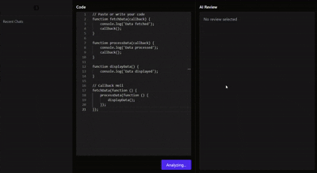

# AICodeReview 🚀

AICodeReview is a full-stack web application that allows users to write, submit, and review code using AI-powered analysis via Gemini-2.5-Flash API. Users can manage their chat history, submit code for review, and receive structured feedback.

---

## Features ✨

### Backend
- Node.js + Express + TypeScript
- MongoDB for storing users, chat history, and submissions
- JWT + Cookies authentication
- Custom error handling middleware
- Zod input validation
- Gemini API integration for AI-powered code review

### Frontend
- React + TypeScript
- Redux Toolkit for state management
- Monaco Code Editor for advanced coding experience
- React Hook Form + Zod for authentication and code forms
- Tailwind CSS for styling
- React Toastify for notifications
- Users can:
  - Signup/Login securely
  - Submit code for AI review
  - View previous chat and code review history

---

## Tech Stack 🛠️

| Layer         | Technology                                    |
|---------------|-----------------------------------------------|
| Backend       | Node.js, Express, TypeScript, MongoDB         |
| Auth          | JWT, Cookies                                  |
| Validation    | Zod                                           |
| API           | Gemini-2.5-Flash                              |
| Frontend      | React, TypeScript, Redux Toolkit, TailwindCSS |
| Editor        | Monaco Code Editor                            |
| Forms         | React Hook Form + Zod                         |
| Notifications | React Toastify                                |

---

## Demo 🎬

Below is a 30-second demo showcasing the app workflow:

---

